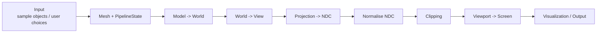

# CGV Pipeline Flowchart

```mermaid
flowchart LR
  A[Input<br/>sample objects / user choices] --> B[Mesh + PipelineState]
  B --> C[Model -> World]
  C --> D[World -> View]
  D --> E[Projection -> NDC]
  E --> F[Normalise NDC]
  F --> G[Clipping]
  G --> H[Viewport -> Screen]
  H --> I[Visualization / Output]
```
